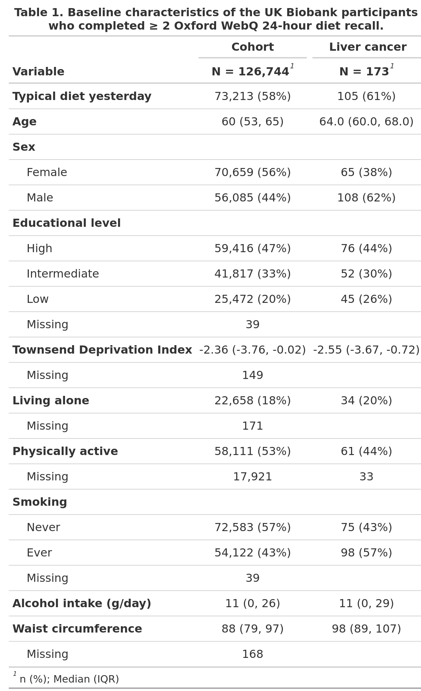
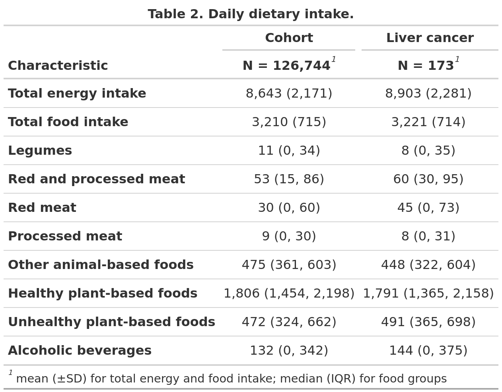
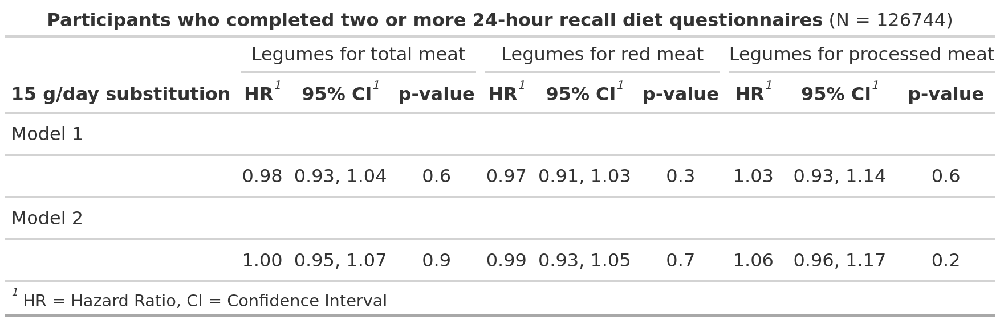

```{r setup, include=FALSE}
knitr::opts_chunk$set(echo = FALSE)
```

# Abstract

Objective:

Research Design and Methods:

Results:

Conclusions:

# Introduction

# Research Design and Methods

**Study population**

The UK Biobank, a population-based prospective cohort, were initiated in
2006. [@sudlow2015] During 2006-2010, more than 500,000 participants,
aged 40-69, were recruited and assessed at designated assessment centres
across the UK. Data on sociodemographic factors (education, ethnicity,
Townsend deprivation Index) and lifestyle factors (smoking, alcohol
consumption, physical activity) were collected via touch screen
questionnaires and computer-assisted interviews. Anthropometric data
(BMI, waist circumference) were collected via physical measurements
(reference to UKB document here).

**Dietary assessment**

A web-based diet questionnaire was administered at the end of the
initial assessment visit for the last 70,000 recruited participants
(reference from UKB document here). 320,000 participants who had
provided an e-mail address were invited to complete the diet
questionnaire online. In the annual period February 2011 and April 2012,
participants were invited on 4 separate occasions to complete the diet
questionnaire. The questionnaire comprised the Oxford WebQ, an online
24-hour dietary recall assessment tool covering 206 foods and 32
beverages commonly consumed in the UK with intake categories ranging
from 0 to +3 units of measurement (e.g. servings, cups, slices).
[@piernas2021] The Oxford WebQ has been validated with interviewer-based
24-hour recalls and biomarkers [@Liu2011; @Greenwood2019].

79 food groups and 14 beverage groups were classified using UK National
Diet and Nutrition Survey (NDNS) categories [@Liu2011; @Greenwood2019].
We used this classification to categorise intake of foods groups to
match our substitution analysis. Legume intake was defined as intake of
dietary pulses, baked beans, tofu-based products, peas, hummus, soya
drinks, and soya-based desserts and yoghurt; red meat intake was defined
as intake of beef, pork, lamb, or other meat, including offal. Processed
meat intake was defined as sausages, bacon (with and without fat), ham,
or liver pate. Other food groups included were poultry, fish, dairy, egg
and egg dishes, whole grains, refined grains, vegetables, fruits, nuts
and seeds, fats and spreads, mixed dishes, sweets and snacks,
non-alcoholic beverages, and alcoholic beverages (supplemental table 1).

Due to the incapability of a single 24-hour dietary recall evaluation to
properly assess variation in diet over time (reference to nutritional
epi methods here?), only participants who completed two or more
questionnaires were eligible for inclusion (reference to nutritional epi
methods that two 24-hour recall is sufficient to capture variation in
diet here?).

**Liver cancer assessment**

Liver cancer was defined according to ICD-10 diagnosis codes C22.0
Hepatocellular carcinoma (HCC) or C22.1 Intrahepatic cholangiocarcinoma
(ICC). Incident and prevalent cases of liver cancer and corresponding
diagnosis dates were obtained via linkage to central cancer registers or
hospital inpatient episodes
[\@sudlow2015](reference%20from%20UKB%20document%20here).

**Assessment of confounders**

Confounders were defined *a priori* from a literature review of diet
components as exposure and liver cancer as the outcome and illustrated
using directed acyclic graphs (supplemental fig. 1.). The following
confounding variables were identified: age (years \[continuous\]), sex
(male, female \[categorical\]), educational level (high (College or
University degree), intermediate (A levels/AS levels, O levels/GCSEs, or
equivalent), low (none of the previous mentioned) \[categorical\]),
Townsend Deprivation Index (\[continuous\]), Living alone (yes, no
\[categorical\]), ethnicity (white, other \[categorical\]), body mass
index ( \<25 kg/m^2^, 25-30 kg/m^2^, \>30 kb/m^2^ \[categorical\]),
waist circumference (cm \[continuous\]), physical activity (above/below
daily MET recommendation for moderate physical activity \[categorical\],
smoking status (never, former, current \[categorical\]), alcohol intake
(grams/day \[continuous\]), history of diabetes (yes, no
\[categorical\], Non-alcoholic liver disease (NAFLD), (yes, no
\[categorical\], and history of cholelithiasis and/or cholecystectomy
(yes, no \[categorical\]). Sociodemographic and anthropometric
confounders were selected from the initial assessment visit before the
start of follow-up. Diagnosis and corresponding date of diagnosis of
diabetes, NAFLD, and cholelithiasis before start of follow-up were
selected via linkage to ICD-10 and ICD-9 inpatient hospital episodes.
For definitions of diagnoses, see supplemental table 2.

**The substitution model**

Substitutions were carried out in an equal-mass manner, i.e.,
substituting x grams of red meats with x grams of legumes. The size of
the substitution was set to 15 grams of legumes for 15 grams of red
meats to keep the substitution size below the mean intake any of the
substituted food groups in the cohort. Substitutions were modelled using
the leave-one-out-approach in which variables for every food group along
with a variable for total food intake are included, except the food
group that are to be substituted [@Ibsen2021]. To estimate substitution
of 15 grams of all red meats with 15 grams of legumes, the following
model was defined: $$
log(h(t;x)) = log(h(0;t)) + \beta_1 Legumes (15g) + \beta_2 Total food intake (g) + \beta_3 Other food groups(g) + \beta_4 Covariates
$$ When substituting red meat with legumes, processed meat was added to
the model: $$
log(h(t;x)) = log(h(0;t)) + \beta_1 Legumes (15g) + \beta_2 Processed meat (15g) + \beta_3 Total food intake (g) + \beta_4 Other food groups(g) + \beta_5 Covariates
$$ When substituting processed meat with legumes, red meat was added to
the model: $$
log(h(t;x)) = log(h(0;t)) + \beta_1 Legumes (15g) + \beta_2 Red meat (15g) + \beta_3 Total food intake (g) + \beta_4 Other food groups(g) + \beta_5 Covariates
$$ **Statistical analysis**

Multivariable-adjusted Cox proportional hazards regression models were
used to estimate hazard ratios (HR) with corresponding 95% confidence
intervals (CI) with age as the underlying timescale. Participants were
followed from the date of their last completed diet questionnaire until
the event of interest occurred or due to right censoring, whichever came
first. Participants were right censored due to one of the following
events occurring: death, loss to follow-up, or administrative end of
follow-up (set to Jan 31, 2022). Two levels of adjustments were added to
the substitution model. Model 1 were minimally adjusted for age, sex,
total weight of food intake, and all other foods groups. Model 2 were
further adjusted for educational level, Townsend Deprivation Index,
ethnicity, living alone, smoking status, alcohol intake, BMI, waist
circumference, diabetes, NAFLD, cholelithiasis, and cholecystectomy.

A stratified analysis on each cancer type was performed to test whether
pooling of HCC and ICC as an outcome was justified. Further, the
following sensitivity analyses were performed to test the robustness of
the main analysis:

1.       Due to the events per variable being very low in the fully
adjusted analysis and thus increasing the risk of biased estimates in
the cox regression model, a simpler model was defined. To reduce number
of variables, food groups were polled in fewer groups and only
confounders hypothesized to have the greatest impact on the estimate
were included in this model.

2.       Exclusion of high alcohol consumers.

3.       Exclusion of food intake misreporters.

4.       Exclusion of participants with any other liver disease before
baseline.

5.       Exclusion of participants with any form of cancer before
baseline.

6.       Exclusion of the first two years of follow-up.

7.       Eligibility criteria for number of completed diet
questionnaires were set to ≥3, ≥4, and ≥ 5 completed questionnaires.

8.       Imputation of missing data.

All analyses were conducted in R with a significance level of 5 %.

# Results







# Conclusions

# Acknowledgements

# References

::: {#refs}
:::

# Tables

# Figures

# Supplemental Material

| **Food group**                                  | **Includes**                                                                                                                              | UK Biobank ID number |
|---------------|------------------------------------------|---------------|
| **Legumes**                                     |                                                                                                                                           |                      |
| Soya-based desserts & yogurt                    | Soya-based desserts                                                                                                                       | p26086               |
| Legumes/pulses                                  | Baked beans, pulses                                                                                                                       | p26101               |
| Soy drink                                       | Soya drinks (including calcium fortified)                                                                                                 | p26136               |
| Soy-based meals                                 | Tofu-based products                                                                                                                       | p26137               |
| Vegetable dips                                  | Hummus, guacamole (assuming 50% hummus)                                                                                                   | p26144               |
| Peas/sweetcorn                                  | Peas, sweetcorn (assuming 50% peas)                                                                                                       | p26115               |
| **Red meat**                                    |                                                                                                                                           |                      |
| Beef                                            | Beef                                                                                                                                      | p26066               |
| Lamb                                            | Lamb                                                                                                                                      | p26100               |
| Other meat, offal                               | Other meat including offal                                                                                                                | p26104               |
| Pork                                            | Pork                                                                                                                                      | p26117               |
| **Processed meat**                              |                                                                                                                                           |                      |
| Processed meat                                  | Sausages, bacon (with and without fat), ham, liver pate                                                                                   | p26122               |
| **Animal-based foods**                          |                                                                                                                                           |                      |
| Poultry                                         |                                                                                                                                           |                      |
| Breaded/battered Chicken                        | Fried poultry with batter/breadcrumbs                                                                                                     | p26069               |
| Poultry                                         | Poultry (with/without skin)                                                                                                               | p26121               |
| Fish                                            |                                                                                                                                           |                      |
| Breaded/battered Fish                           | Fried fish with batter/breadcrumbs                                                                                                        | p26070               |
| Oily fish                                       | Oily fish, including salmon,                                                                                                              | p26109               |
| Shellfish                                       | Prawns, lobster, crab, shellfish                                                                                                          | p26132               |
| White fish & tinned tuna                        | Tinned tuna, white fish, other fish                                                                                                       | p26149               |
| Dairy                                           |                                                                                                                                           |                      |
| Dairy fat spread lower fat                      | Spreadable/lower fat butter, dairy-based very low fat spread                                                                              | p26062               |
| Dairy fat spread                                | Spreadable normal fat butter, dairy-based normal fat spread (including cholesterol lowering spread)                                       | p26063               |
| Milk-dairy desserts                             | Ice cream, milk puddings, milk-based desserts, cheesecake                                                                                 | p26084               |
| Milk-based & powdered drinks                    | Dairy-based smoothies, milk-based drinks, hot chocolate                                                                                   | p26087               |
| Full fat yogurt                                 | Whole milk yogurt (plain)                                                                                                                 | p26096               |
| High fat cheese                                 | Cheese \>17.5 g fat per 100 g, including hard cheese, soft cheese, spreadable, Blue, Feta, Mozzarella, Goats, other)                      | p26099               |
| Low fat yogurt                                  | Fat free and lower fat yogurt, plain or flavoured                                                                                         | p26102               |
| Medium & low fat cheese                         | Cheese \<=17.5g fat per 100 g, including hard and spreadable lower fat cheese, Cottage                                                    | p26103               |
| Semi-skimmed milk                               | Semi-skimmed milk \>1 g fat per 100 g (cow, other)                                                                                        | p26131               |
| Skimmed milk                                    | Skimmed milk \<1 g fat per 100 g (cow, cholesterol lowering, powdered)                                                                    | p26133               |
| Whole milk                                      | Whole milk \>3.6 g fat per 100 g (cow, goat, sheep)                                                                                       | p26150               |
| Cream                                           | Cream (cow’s milk)                                                                                                                        | p26154               |
| Eggs                                            |                                                                                                                                           |                      |
| *Egg and egg dishes*                            | Whole eggs and processed (omelette, scotch eggs, other)                                                                                   | p26088               |
| Sauces                                          |                                                                                                                                           |                      |
| Sauces (higher fat)                             | Mayonnaise, salad dressing, pesto, cheese sauce, white sauce, gravy                                                                       | p26129               |
| Sauces (lower fat)                              | Yeast, chutney, olives, ketchup, brown sauce, tomato sauce                                                                                | p26130               |
| Mixed dishes                                    |                                                                                                                                           |                      |
| Pizza                                           | Pizza (including gluten free crust)                                                                                                       | p26116               |
| Savoury snacks                                  | Crisps, savoury biscuits, cheese snacks, other savoury biscuits                                                                           | p26134               |
| Soups                                           | Soups, homemade, powdered and canned                                                                                                      | p26135               |
| Sushi                                           | Sushi                                                                                                                                     | p26139               |
| **Healthy plant-based foods**                   |                                                                                                                                           |                      |
| Whole grains                                    |                                                                                                                                           |                      |
| Mixed bread, brown & seeded                     | Mixed, brown or seeded bread, sliced, baguette, bap, roll                                                                                 | p26071               |
| Wholemeal bread                                 | Wholemeal bread, sliced, baguette, bap, roll                                                                                              | p26074               |
| Biscuit cereal                                  | Wholewheat biscuit cereal                                                                                                                 | p26075               |
| Bran cereal                                     | Bran cereal                                                                                                                               | p26076               |
| Oat cereal (non-sugar)                          | Porridge oats (including milk/dried fruit added)                                                                                          | p26077               |
| Oat cereal (sugar)                              | Oatcrunch breakfast cereal                                                                                                                | p26078               |
| Muesli                                          | Muesli (with or without dried fruit)                                                                                                      | p26105               |
| Wholemeal pasta, brown rice & other wholegrains | Brown and wholemeal pasta and rice                                                                                                        | p26114               |
| Fruits                                          |                                                                                                                                           |                      |
| Apples & pears                                  | Apples and pears                                                                                                                          | p26089               |
| Berries                                         | Blackberries, strawberries, blueberries, raspberries, cherries                                                                            | p26090               |
| Citrus                                          | Grapefruit, orange, satsuma                                                                                                               | p26091               |
| Dried fruit                                     | Dried fruit, prunes                                                                                                                       | p26092               |
| Bananas & other fruit                           | Bananas, mixed fruit, grapes, mango, melon, peach, pineapple, kiwi, other                                                                 | p26093               |
| Stewed fruit                                    | Stewed fruit, plums                                                                                                                       | p26094               |
| Nuts                                            |                                                                                                                                           |                      |
| Nut-based spreads                               | Peanut-butter and chocolate-based spread                                                                                                  | p26106               |
| Unsalted nuts & seeds                           | Unsalted peanuts and nuts                                                                                                                 | p26107               |
| Salted nuts & seeds                             | Salted peanuts and nuts                                                                                                                   | p26108               |
| Plant oils                                      |                                                                                                                                           |                      |
| Olive oil ( drizzling/dunking)                  | Olive oil                                                                                                                                 | p26110               |
| Vegetable spread lower fat                      | Olive oil based lower fat spread, plant-based lower fat margarine and soya-based lower fat spread (including cholesterol lowering spread) | p26111               |
| Vegetable spread                                | Olive oil based spread, plant-based soft or hard margarine and soya-based spread (including cholesterol lowering spread)                  | p26112               |
| Tea, coffee & water                             |                                                                                                                                           |                      |
| Coffee, caffeinated                             | Normal instant, filter, cappuccino, espresso coffee                                                                                       | p26081               |
| Coffee, decaffeinated                           | Decaffeinated instant, filter, cappuccino, espresso coffee                                                                                | p26082               |
| Tea                                             | Black, green and other tea                                                                                                                | p26141               |
| Tea, decaffeinated                              | Decaffeinated black, herbal tea, rooibos                                                                                                  | p26142               |
| Water/sparkling water                           | Plain water, sparkling water                                                                                                              | p26148               |
| Vegetables                                      |                                                                                                                                           |                      |
| Allium vegetables                               | Garlic, leek, onion                                                                                                                       | p26065               |
| Green leafy/cabbages                            | Broccoli, cabbage, kale, cauliflower, spinach, sprouts                                                                                    | p26098               |
| Raw salad                                       | Mixed side salad, lettuce, watercress                                                                                                     | p26123               |
| Root vegetables                                 | Beetroot, carrots, celery, parsnip, turnip                                                                                                | p26125               |
| Tomatoes                                        | Fresh and tinned tomatoes                                                                                                                 | p26143               |
| Other vegetables (mushrooms, fruiting, mixed)   | Mushrooms, mixed vegetables, avocado, broad beans, green beans, butternut squash, courgettes, peppers, other                              | p26146               |
| Vegetable side dishes                           | Coleslaw, salad with added fat/mayonnaise                                                                                                 | p26147               |
| Vegetable dips                                  | Hummus, guacamole (assuming 50% guacamole)                                                                                                | p26144               |
| Peas/sweetcorn                                  | Peas, sweetcorn (assuming 50% sweetcorn)                                                                                                  | p26115               |
| **Unhealthy plant-based foods**                 |                                                                                                                                           |                      |
| Refined cereals                                 |                                                                                                                                           |                      |
| Biscuits                                        | Chocolate biscuits, plain biscuits, sweet biscuits and cookies                                                                            | p26068               |
| Other bread                                     | Naan, garlic bread, other bread (including gluten free)                                                                                   | p26072               |
| White bread                                     | White bread, sliced, baguette, bap, roll                                                                                                  | p26073               |
| Oat cereal (sugar)                              | Oatcrunch breakfast cereal                                                                                                                | p26079               |
| Savoury snacks                                  | Crisps, savoury biscuits, cheese snacks, other savoury biscuits                                                                           | p26083               |
| White pasta & rice                              | White pasta, rice, couscous, gluten free pasta                                                                                            | p26113               |
| Potatoes                                        |                                                                                                                                           |                      |
| Potatoes/sweet potatoes (baked/boiled)          | Potatoes, sweet potatoes, boiled or baked                                                                                                 | p26118               |
| Fried/roast potatoes                            | Potatoes and chips, fried or roasted with fat                                                                                             | p26119               |
| Mashed potatoes                                 | Potatoes, mashed                                                                                                                          | p26120               |
| Fruit juice                                     |                                                                                                                                           |                      |
| Fruit juice                                     | Orange, grapefruit drink and 100% fruit juice                                                                                             | p26095               |
| Mixed dishes, vegetarian                        |                                                                                                                                           |                      |
| Grain dishes - added fat                        | Double and single crust pies, crumble pies, Yorkshire pudding, snackpot noodles                                                           | p26097               |
| Samosa, pakora                                  | Indian samosa, pakora snacks                                                                                                              | p26128               |
| Vegetarian meals                                | Quorn-based and vegetarian burgers and products                                                                                           | p26145               |
| Sweets & snacks                                 |                                                                                                                                           |                      |
| Added sugars & preserves                        | Table sugar, honey, jam and preserves                                                                                                     | p26064               |
| Chocolate confectionery                         | Chocolate bar (including white, milk and dark chocolate), chocolate-covered raisins, chocolate-covered sweets                             | p26080               |
| Desserts & cakes & pastries                     | Pancakes, croissant, Danish pastries, scones, fruitcakes, cakes, doughnuts, sponge puddings, other desserts, cereal bars, sweet snacks    | p26085               |
| Other sweets                                    | Hard and soft sweets (including sugar free)                                                                                               | p26140               |
| Sugar sweetened beverages                       |                                                                                                                                           |                      |
| Rice/oat drink                                  | Rice and oat vegetable drinks                                                                                                             | p26124               |
| Low/non sugar SSBs                              | Low calorie fizzy drinks and squash                                                                                                       | p26126               |
| SSBs & other sugary drinks                      | Fizzy sugary drinks, squash, fruit smoothies                                                                                              | p26127               |
| **Alcoholic beverages**                         |                                                                                                                                           |                      |
| Beer & Cider                                    | Beer and cider                                                                                                                            | p26067               |
| Spirits                                         | Spirits and other alcoholic drinks                                                                                                        | p26138               |
| Fortified wine                                  | Fortified wine                                                                                                                            | p26151               |
| Red wine                                        | Red and rose wine                                                                                                                         | p26152               |
| White wine                                      | White wine                                                                                                                                | p26153               |

: Supplementary table 1.
